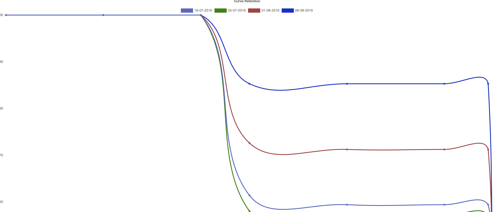

## All code under
app/RetentionCurve folder


## Run application
### Run application by docker
```bash
# Run application
$ docker-compose up --build --remove-orphans 
# or
$ docker-compose up 


 
```
### Run application by php
```bash
# go to app directory
$ composer install  

$ php artisan serve --port=8182  
# or
$ export SERVER_PORT="8182" 
$ php artisan serve
 
```
Go to http://localhost:8182/api/retention-curves/index
#### You can change port in docker-compose file  "8182" to any valid other port and need to change it in vue app too
## Run unit tests
```bash
# run docker command to access application bash
$ docker exec -it temper-api bash
# run this command
$ ./vendor/bin/phpunit tests/  

```
#### Notes
* make enusre renamed .env.exmaple
* to install docker Mac or windows [link](https://www.docker.com/products/docker-desktop) for Ubuntu [link](https://docs.docker.com/engine/install/ubuntu/)


